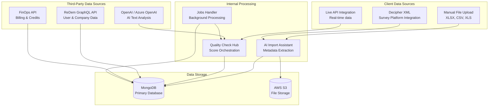
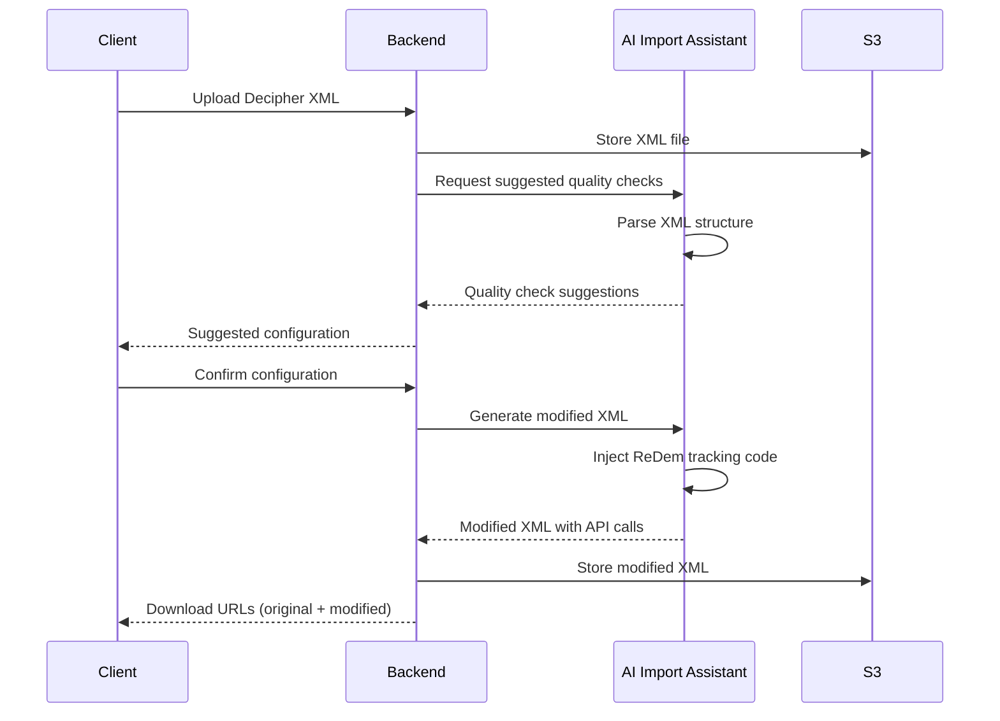
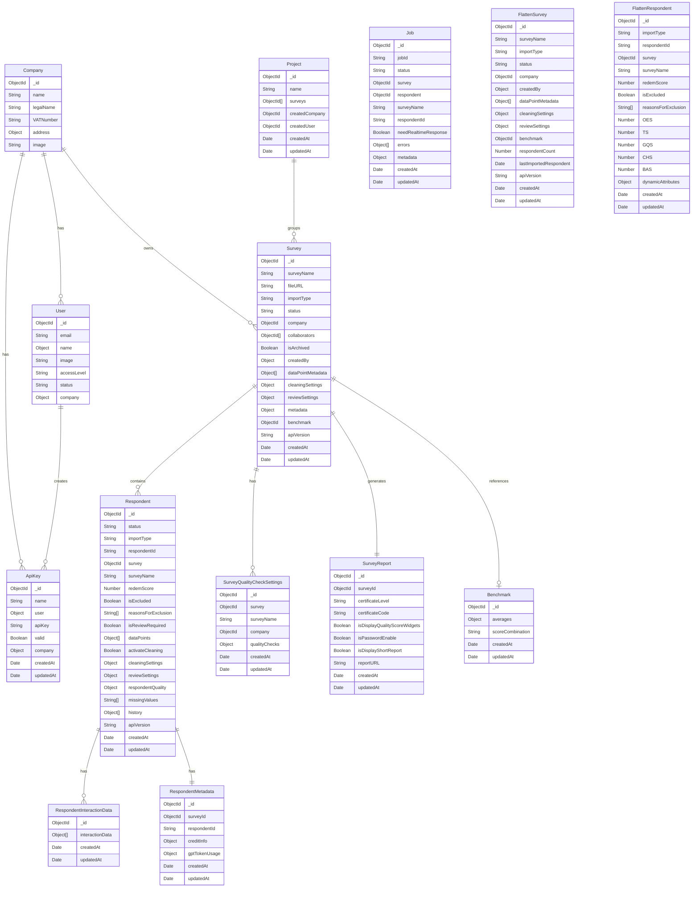
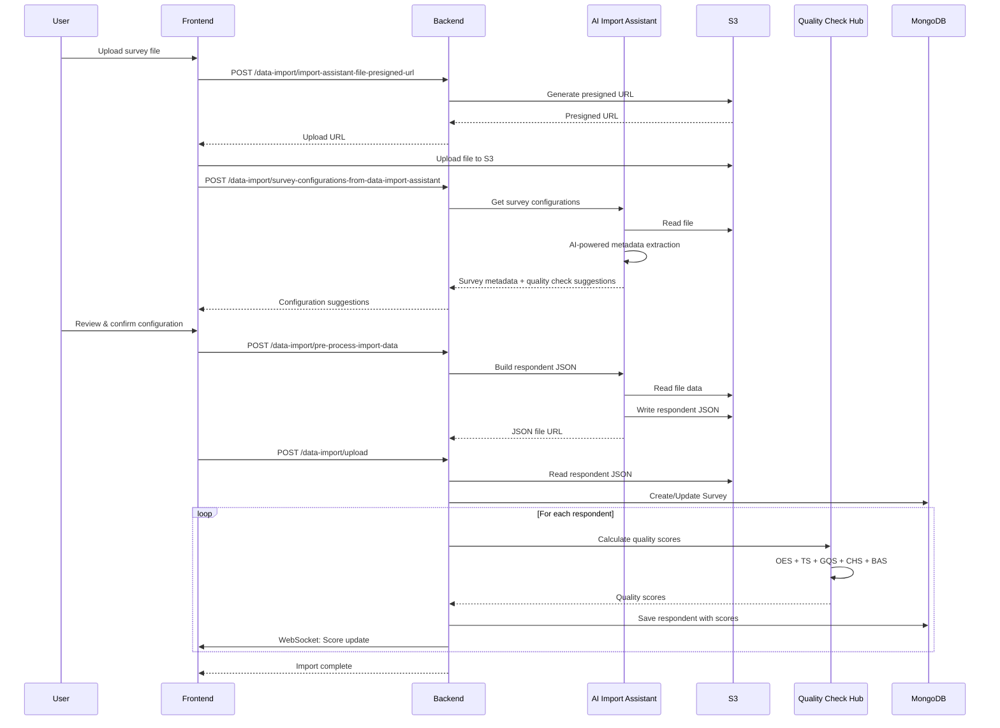
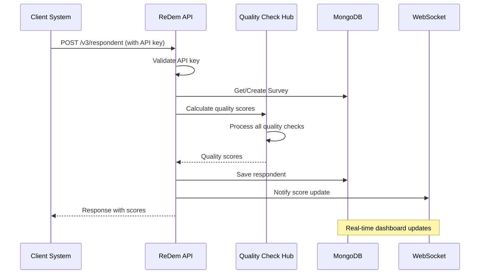

# ReDem Data Architecture

This document provides a comprehensive overview of the data architecture for the ReDem platform, including key data sources, client-specific inputs, third-party data integrations, and the underlying data model.

## Table of Contents

1. [Overview](#overview)
2. [Data Sources Diagram](#data-sources-diagram)
3. [Client-Specific Data Inputs](#client-specific-data-inputs)
4. [Third-Party Data Sources](#third-party-data-sources)
5. [Data Model](#data-model)
6. [Data Flow](#data-flow)
7. [Quality Check Data Structures](#quality-check-data-structures)

---

## Overview

ReDem is a survey data quality platform that ingests respondent data from various sources, processes it through AI-powered quality checks, and stores comprehensive quality scores and analytics. The platform handles both real-time (LIVE) and batch (MANUAL) data imports, supporting multiple file formats and integration methods.

### Key Data Characteristics

| Characteristic | Description |
|----------------|-------------|
| **Database** | MongoDB (Document-based NoSQL) |
| **Primary Data Types** | Survey responses, Quality scores, User/Company data, Billing data |
| **Import Methods** | Manual file upload, Live API integration, Decipher XML integration |
| **File Formats Supported** | XLSX, CSV, XLS |
| **Quality Score Types** | OES, GQS, TS, CHS, BAS |

---

## Data Sources Diagram



---

## Client-Specific Data Inputs

### 1. Survey Response Data

The primary client data input is survey response data containing respondent answers and metadata.

#### Supported File Formats

| Format | Extension | Library Used | Description |
|--------|-----------|--------------|-------------|
| Excel (Modern) | `.xlsx` | openpyxl | OpenXML format, preferred |
| Excel (Legacy) | `.xls` | xlrd | Legacy Excel format |
| CSV | `.csv` | pandas | Comma-separated values |

#### Required File Structure

```
┌─────────────────────────────────────────────────────────────┐
│ Row 1 (Optional)   │ Question Text Row (Q1, Q2, Q3...)     │
├─────────────────────────────────────────────────────────────┤
│ Row 2              │ Header Row (Column identifiers)       │
├─────────────────────────────────────────────────────────────┤
│ Row 3+             │ Respondent Data Rows                  │
└─────────────────────────────────────────────────────────────┘
```

#### File Metadata Configuration

| Field | Type | Description | Auto-Detected |
|-------|------|-------------|---------------|
| `surveyName` | String | Unique identifier for the survey | ✅ |
| `headerRow` | Number | Row index containing column headers | ✅ |
| `questionTextRow` | Number | Row index with full question text | ✅ |
| `respondentStartRow` | Number | First row of respondent data | ✅ |
| `respondentIdColumn` | String | Column containing unique respondent IDs | ✅ |
| `missingValues` | String[] | Values to treat as missing/null | ✅ |
| `questionnaireLanguageColumn` | String | Column with respondent language | ❌ |

### 2. Quality Check Data Points

Clients configure which quality checks to apply and which columns map to each check type.

#### OES (Open-Ended Score) Data Points

```json
{
  "qualityCheck": "OES",
  "dataPointId": "Q1_open",
  "question": "What did you like about the product?",
  "answer": "The respondent's open-ended response",
  "keywords": ["quality", "price", "design"],
  "activateDuplicateDetection": true,
  "allowedLanguages": [
    { "name": "English", "code": "en" },
    { "name": "German", "code": "de" }
  ]
}
```

#### GQS (Grid-Questions Score) Data Points

```json
{
  "qualityCheck": "GQS",
  "dataPointId": "Q5_grid",
  "gridAnswersPattern": [1, 2, 3, 4, 5, 3, 2],
  "patternCheckEnabled": true,
  "startingColumn": "Q5_1",
  "endingColumn": "Q5_7",
  "allColumns": ["Q5_1", "Q5_2", "Q5_3", "Q5_4", "Q5_5", "Q5_6", "Q5_7"],
  "labelsToCodes": {
    "Strongly Agree": 5,
    "Agree": 4,
    "Neutral": 3,
    "Disagree": 2,
    "Strongly Disagree": 1
  }
}
```

#### TS (Time Score) Data Points

```json
{
  "qualityCheck": "TS",
  "dataPointId": "TotalDuration",
  "duration": 245,
  "columnName": "interview_length",
  "description": "Total interview duration in seconds"
}
```

#### CHS (Coherence Score) Data Points

```json
{
  "qualityCheck": "CHS",
  "dataPointId": "CHSCheck",
  "interviewData": [
    {
      "questionId": "Q1",
      "question": "How satisfied are you with our product?",
      "answer": "Very satisfied with the quality"
    },
    {
      "questionId": "Q2",
      "question": "Would you recommend us?",
      "answer": "Yes, definitely would recommend"
    }
  ]
}
```

#### BAS (Behavioral Analytics Score) Data Points

```json
{
  "qualityCheck": "BAS",
  "dataPointId": "BASCheck_Q1",
  "interactionData": {
    "interactionData": [
      {
        "value": "T",
        "interactionType": "KEYSTROKE",
        "timestamp": "2024-01-15T10:30:00.000Z"
      },
      {
        "value": "he product is great",
        "interactionType": "COPY_AND_PASTE",
        "timestamp": "2024-01-15T10:30:01.500Z"
      }
    ]
  }
}
```

### 3. Decipher XML Integration

For clients using the Decipher survey platform, XML configuration files can be uploaded to automatically configure quality checks.

#### Decipher Integration Data Flow



### 4. Cleaning Settings Configuration

Clients configure automatic data cleaning rules based on quality scores.

```json
{
  "cleaningSettings": {
    "redemScore": 50,
    "OES": {
      "activate": true,
      "score": 60,
      "minDataPoints": 2,
      "categories": {
        "GENERIC_ANSWER": { "activate": true, "minDataPoints": 1 },
        "NO_INFORMATION": { "activate": true, "minDataPoints": 1 },
        "BAD_LANGUAGE": { "activate": true, "minDataPoints": 1 },
        "NONSENSE": { "activate": true, "minDataPoints": 1 },
        "DUPLICATE_ANSWER": { "activate": true, "minDataPoints": 1 },
        "DUPLICATE_RESPONDENT": { "activate": true, "minDataPoints": 1 },
        "WRONG_TOPIC": { "activate": false, "minDataPoints": 1 },
        "WRONG_LANGUAGE": { "activate": true, "minDataPoints": 1 },
        "AI_GENERATED_ANSWER": { "activate": true, "minDataPoints": 1 },
        "GIBBERISH": { "activate": true, "minDataPoints": 1 },
        "OFF_TOPIC": { "activate": false, "minDataPoints": 1 },
        "NO_ANSWER": { "activate": true, "minDataPoints": 1 },
        "AI_SUSPECT": { "activate": true, "minDataPoints": 1 }
      }
    },
    "CHS": { "activate": true, "score": 50 },
    "GQS": { "activate": true, "score": 40, "minDataPoints": 1 },
    "TS": { "activate": true, "score": 30 },
    "BAS": {
      "activate": true,
      "score": 50,
      "minDataPoints": 1,
      "categories": {
        "UNNATURAL_TYPING": { "activate": true, "minDataPoints": 1 },
        "COPY_AND_PASTE": { "activate": true, "minDataPoints": 1 }
      }
    }
  }
}
```

---

## Third-Party Data Sources

### 1. OpenAI / Azure OpenAI

Used for AI-powered text analysis in OES and CHS quality checks.

| Service | Purpose | Data Exchanged |
|---------|---------|----------------|
| **OES Scoring** | Evaluate open-ended response quality | Question text, respondent answer, keywords |
| **CHS Scoring** | Detect coherence across interview responses | Multiple Q&A pairs from same respondent |
| **Metadata Extraction** | Auto-detect file structure | First 10 rows of survey data |
| **Quality Check Detection** | Suggest appropriate quality checks | Column headers, sample data |

#### Data Sent to OpenAI

```json
{
  "model": "gpt-4.1",
  "messages": [
    {
      "role": "system",
      "content": "Evaluate the quality of survey responses..."
    },
    {
      "role": "user",
      "content": {
        "question": "What improvements would you suggest?",
        "answer": "better customer service and faster delivery",
        "keywords": ["improvement", "suggestion", "feedback"]
      }
    }
  ]
}
```

#### Data Returned from OpenAI

```json
{
  "score": 85,
  "category": "VALID_ANSWER",
  "effort": "MEDIUM",
  "reason": "Response addresses the question with specific suggestions"
}
```

### 2. ReDem GraphQL API

External API providing user and company management data.

| Data Type | Description | Usage |
|-----------|-------------|-------|
| **User Authentication** | JWT token verification | Login, session management |
| **User Profile** | Name, email, access level | Display, permissions |
| **Company Information** | Company ID, name | Multi-tenant isolation |
| **User Management** | Create, update, delete users | Admin functions |

#### GraphQL Query Example

```graphql
query me {
  me {
    id
    email
    accessLevel
    status
    name {
      first
      last
    }
    image
    company {
      id
      name
    }
  }
}
```

### 3. FinOps API

Internal microservice providing billing and credit management.

| Endpoint | Purpose | Data |
|----------|---------|------|
| `POST /credits/estimation/singleRespondent` | Estimate credits for a respondent | Data points, company ID |
| `POST /credits/creditApprovalForDataImport` | Approve credits for import | Respondent data, survey ID |
| `POST /credits/verifyWalletBalance` | Check sufficient balance | Company ID, required amount |

#### Credit Estimation Data Structure

```json
{
  "creditEstimation": 4,
  "creditEstimationBreakdown": [
    { "qualityScore": "OES", "credits": 2, "numberOfDataPoints": 2 },
    { "qualityScore": "GQS", "credits": 1, "numberOfDataPoints": 1 },
    { "qualityScore": "TS", "credits": 0.5, "numberOfDataPoints": 1 },
    { "qualityScore": "CHS", "credits": 0.5, "numberOfDataPoints": 1 }
  ]
}
```

### 4. AWS Services

| Service | Purpose | Data Stored |
|---------|---------|-------------|
| **S3** | File storage | Survey files, processed JSON, XML files |
| **SQS** | Message queue | Job triggers for background processing |
| **Lambda** | Serverless compute | Jobs Handler execution |
| **CloudWatch** | Logging | Application logs, metrics |

### 5. RabbitMQ

Used for internal messaging and real-time notifications.

| Queue/Exchange | Purpose |
|----------------|---------|
| Respondent updates | Real-time score updates to frontend |
| Job completion | Notify on background job completion |

---

## Data Model

### MongoDB Collections



### Collection Details

#### Core Collections

| Collection | Purpose | Key Fields |
|------------|---------|------------|
| `surveys` | Survey configuration and metadata | surveyName, importType, status, dataPointMetadata |
| `respondents` | Full respondent data with quality scores | respondentId, dataPoints, respondentQuality, redemScore |
| `flattensurveys` | Denormalized survey data for fast queries | respondentCount, lastImportedRespondent |
| `flattenrespondents` | Denormalized scores for reporting | OES, TS, GQS, CHS, BAS scores |

#### Supporting Collections

| Collection | Purpose | Key Fields |
|------------|---------|------------|
| `apikeys` | API key management | apiKey, user, company, valid |
| `jobs` | Background job tracking | status, errors, metadata |
| `respondentinteractiondatas` | BAS keystroke data | interactionData array |
| `respondentmetadatas` | Credit usage tracking | creditInfo, gptTokenUsage |
| `surveyqualitychecksettings` | Saved quality check configurations | qualityChecks, qualityCheckSummary |
| `surveyreports` | Generated report metadata | certificateLevel, reportURL |
| `benchmarks` | Benchmark score data | averages, scoreCombination |
| `projects` | Survey grouping | surveys array |

---

## Data Flow

### Manual Import Data Flow



### Live API Data Flow



---

## Quality Check Data Structures

### Respondent Quality Summary

The final quality assessment stored for each respondent:

```json
{
  "respondentQuality": {
    "qualityScoreSummary": [
      {
        "qualityCheck": "OES",
        "score": 75,
        "reason": "2 of 3 responses were valid"
      },
      {
        "qualityCheck": "GQS",
        "score": 100,
        "reason": "No straightlining detected"
      },
      {
        "qualityCheck": "TS",
        "score": 85,
        "reason": "Duration within acceptable range"
      },
      {
        "qualityCheck": "CHS",
        "score": 90,
        "reason": "Responses are coherent",
        "incoherentQuestions": null
      },
      {
        "qualityCheck": "BAS",
        "score": 70,
        "reason": "Some copy-paste detected"
      }
    ],
    "dataPointsSummary": {
      "OES": [
        {
          "qualityCheck": "OES",
          "dataPointId": "Q1",
          "score": 85,
          "category": "VALID_ANSWER",
          "effort": "MEDIUM",
          "version": "v3",
          "reason": "Addresses question directly",
          "status": "SUCCESS"
        }
      ],
      "GQS": [
        {
          "qualityCheck": "GQS",
          "dataPointId": "Q5_grid",
          "score": 100,
          "reason": "Varied response pattern",
          "status": "SUCCESS"
        }
      ],
      "TS": [
        {
          "qualityCheck": "TS",
          "dataPointId": "TotalDuration",
          "score": 85,
          "status": "SUCCESS"
        }
      ],
      "BAS": [
        {
          "qualityCheck": "BAS",
          "dataPointId": "BASCheck_Q1",
          "score": 70,
          "category": "COPY_AND_PASTE",
          "status": "SUCCESS"
        }
      ]
    }
  }
}
```

### ReDem Score Calculation

The overall ReDem Score is calculated by aggregating individual quality check scores:

```
ReDem Score = Weighted Average of (OES, GQS, TS, CHS, BAS scores)
```

Weights are determined by:
- Number of valid data points per quality check
- Configured importance settings
- Data point validity (excludes missing/invalid data points)

### Data Point States

| State | Description | Score |
|-------|-------------|-------|
| `SUCCESS` | Quality check completed successfully | 0-100 |
| `FAILED` | Quality check encountered an error | -1 |
| `SKIPPED` | Data point had missing/invalid data | N/A |

### Quality Categories

#### OES Categories (v3)

| Category | Description | Impact |
|----------|-------------|--------|
| `VALID_ANSWER` | Response addresses the question | High score |
| `GIBBERISH` | Nonsensical or random text | Low score |
| `OFF_TOPIC` | Response unrelated to question | Low score |
| `NO_ANSWER` | Empty or minimal response | Low score |
| `BAD_LANGUAGE` | Inappropriate content | Flag for review |
| `AI_SUSPECT` | Potentially AI-generated | Flag for review |

#### BAS Categories

| Category | Description | Indicator |
|----------|-------------|-----------|
| `NATURAL_TYPING` | Normal keystroke patterns | High quality |
| `UNNATURAL_TYPING` | Suspicious timing patterns | Lower quality |
| `COPY_AND_PASTE` | Text pasted from clipboard | Flag for review |

---

## Data Security & Privacy

### Data Handling

| Data Type | Storage | Retention | Access Control |
|-----------|---------|-----------|----------------|
| Survey Files | AWS S3 (encrypted) | Until survey deleted | Company-scoped |
| Respondent Data | MongoDB (encrypted at rest) | Survey lifecycle | Company-scoped |
| User Credentials | External GraphQL API | Per user policy | User-scoped |
| API Keys | MongoDB (hashed) | Until revoked | User-scoped |
| AI Processing | Not stored by OpenAI | Transient | API-scoped |

### Multi-Tenant Isolation

All data queries are scoped by company ID to ensure tenant isolation:

```javascript
// Example: All survey queries include company filter
const surveys = await SurveyModel.find({ company: companyId });
```

---

## Data Versioning

### API Versioning

| Version | Supported | Notes |
|---------|-----------|-------|
| v1 | ✅ | Legacy format |
| v2 | ✅ | Extended quality checks |
| v3 | ✅ (Current) | OES v3 categories, BAS support |

### OES Version Differences

| Field | v2 | v3 |
|-------|----|----|
| Categories | 9 categories | 6 categories (simplified) |
| AI Suspect | Not available | Available |
| Effort Scale | Not available | LOW/MEDIUM/HIGH |

---

## Summary

The ReDem data architecture is designed to:

1. **Ingest diverse data sources**: Supporting manual uploads, live API integrations, and third-party platform imports (Decipher)

2. **Process through AI-powered quality checks**: Leveraging OpenAI for text analysis while maintaining data privacy

3. **Store comprehensive quality assessments**: Using MongoDB for flexible document storage with denormalized collections for performance

4. **Scale horizontally**: With background job processing via AWS Lambda/SQS and real-time updates via WebSocket/RabbitMQ

5. **Maintain data isolation**: Through company-scoped access controls and encrypted storage

