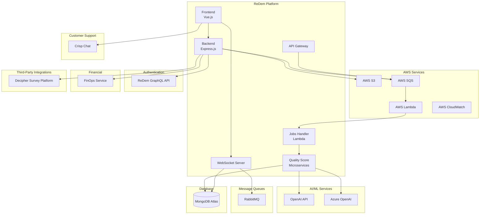
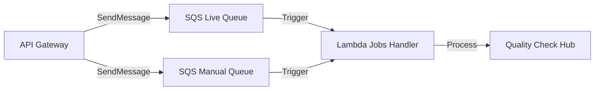
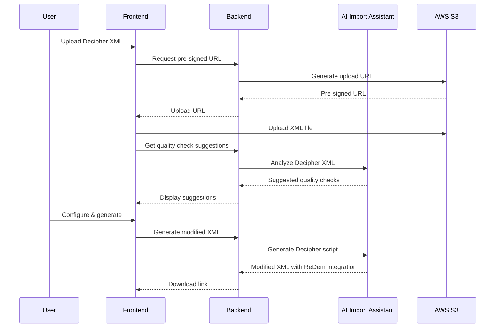

# ReDem Platform - Application Integrations

## Overview

This document provides a comprehensive summary of the external APIs, third-party services, and platform integrations used throughout the ReDem application ecosystem. The platform leverages various cloud services, AI providers, and external systems to deliver survey quality analysis capabilities.

---

## Integration Architecture



---

## AI/ML Service Integrations

### OpenAI API

**Services Using**: OES, CHS Microservices

**Purpose**: AI-powered text analysis for quality scoring of open-ended survey responses and coherence detection.

| Aspect | Details |
|--------|---------|
| **API Endpoint** | `https://api.openai.com/v1/chat/completions` |
| **Authentication** | API Key (Bearer token) |
| **Models Used** | GPT-4, GPT-4o, GPT-4-turbo |
| **SDK** | `openai` npm package (v4.x / v6.x) |

**Use Cases**:
- **OES (Open-Ended Score)**: Detect AI-generated content, inappropriate language, generic responses, off-topic answers, and language detection
- **CHS (Coherence Score)**: Analyze consistency and logical coherence across multiple interview responses

**Integration Pattern**:
```typescript
// OES Service - Category detection
const response = await client.chat.completions.create({
  model: "gpt-4",
  messages: [
    { role: "system", content: categoryPrompt },
    { role: "user", content: respondentPrompt },
  ],
  temperature: 0,
  logprobs: true,
  max_tokens: 50
});
```

**Error Handling**:
- Rate limit retry with exponential backoff
- Request timeout protection (configurable)
- Graceful degradation on API failures

---

### Azure OpenAI Service

**Services Using**: OES Microservice (optional configuration)

**Purpose**: Enterprise-grade OpenAI deployment with enhanced security, compliance, and regional data residency.

| Aspect | Details |
|--------|---------|
| **Authentication** | Azure API Key + Endpoint |
| **Deployment** | Separate instances for LIVE vs MANUAL import types |
| **SDK** | `openai` npm package (AzureOpenAI client) |
| **Content Filter** | Azure content management policy integration |

**Configuration**:
```typescript
const azureClient = new AzureOpenAI({
  apiKey: process.env.AZURE_OPENAI_API_KEY,
  apiVersion: process.env.AZURE_API_VERSION,
  endpoint: process.env.AZURE_OPENAI_ENDPOINT
});
```

**Rationale for Selection**:
- Enterprise compliance requirements
- Data residency in specific regions
- Enhanced content filtering
- Load distribution between LIVE and MANUAL processing

---

## AWS Service Integrations

### Amazon S3 (Simple Storage Service)

**Services Using**: Backend, AI Import Assistant

**Purpose**: Cloud file storage for uploaded survey data files, generated reports, and integration assets.

| Aspect | Details |
|--------|---------|
| **SDK** | `@aws-sdk/client-s3` (v3) |
| **Features Used** | Pre-signed URLs, Object storage, ACL |
| **File Types** | CSV, XLSX, XML, JSON |

**Operations**:
| Operation | Method | Purpose |
|-----------|--------|---------|
| Upload | Pre-signed PUT URL | Client-side file uploads |
| Download | Pre-signed GET URL | Secure file access |
| Read | GetObjectCommand | Server-side file processing |

**Integration Pattern**:
```typescript
// Generate pre-signed upload URL
const getPresignedUrl = async (key: string): Promise<string> => {
  const command = new PutObjectCommand({
    Bucket: bucketName,
    Key: key,
  });
  return await getSignedUrl(s3Client, command, { expiresIn: 3600 });
};
```

---

### Amazon SQS (Simple Queue Service)

**Services Using**: API Gateway, Jobs Handler

**Purpose**: Decoupled message queue for asynchronous job processing of respondent quality checks.

| Aspect | Details |
|--------|---------|
| **SDK** | `@aws-sdk/client-sqs` (v3) |
| **Queue Types** | LIVE Queue, MANUAL Queue |
| **Message Format** | JSON (Job data with respondent info) |

**Queue Architecture**:


**Rationale**:
- Decouples API response time from processing time
- Enables automatic scaling via Lambda triggers
- Provides built-in retry with dead-letter queues
- Separates priority processing (LIVE vs MANUAL)

---

### AWS Lambda

**Services Using**: Jobs Handler

**Purpose**: Serverless compute for processing quality check jobs triggered by SQS events.

| Aspect | Details |
|--------|---------|
| **Runtime** | Node.js 18.x |
| **Trigger** | SQS Event Source Mapping |
| **SDK** | `@aws-sdk/client-lambda` (for invocation) |
| **Timeout** | Configurable (with protection buffer) |

**Benefits**:
- Pay-per-execution cost model
- Automatic scaling based on queue depth
- No server maintenance required
- Native SQS integration

---

### Amazon CloudWatch

**Services Using**: Backend, Jobs Handler

**Purpose**: Logging, monitoring, and metrics collection for application observability.

| Aspect | Details |
|--------|---------|
| **SDK** | `@aws-sdk/client-cloudwatch`, `@aws-sdk/client-cloudwatch-logs` |
| **Features** | Log streams, Metrics, Alarms |

---

## Message Queue Integrations

### RabbitMQ

**Services Using**: WebSocket Server

**Purpose**: Real-time message passing for respondent completion notifications and event distribution.

| Aspect | Details |
|--------|---------|
| **Client** | `amqplib` npm package |
| **Protocol** | AMQP 0-9-1 |
| **Connection** | Persistent with auto-reconnection |

**Features**:
- Durable queues for message persistence
- Prefetch control for ordered processing
- Automatic acknowledgment handling
- Channel pooling and reuse

**Integration Pattern**:
```typescript
// Consume messages from queue
await RabbitMQService.consumeFromQueue("queue-name", async (msg) => {
  // Process message
  // ACK handled automatically
});
```

**Rationale**:
- Lower latency than SQS for real-time events
- Advanced routing capabilities
- Better suited for internal microservice communication

---

## Database Integration

### MongoDB Atlas

**Services Using**: All backend services, Microservices

**Purpose**: Primary data store for surveys, respondents, quality scores, and application data.

| Aspect | Details |
|--------|---------|
| **Driver** | Mongoose ODM via `@redem-gmbh/redem-3.0-db-schemas` |
| **Deployment** | MongoDB Atlas (managed) |
| **Features** | Aggregation pipelines, Indexes, Transactions |

**Shared Schema Package**:
All services use a centralized npm package for schema consistency:
```typescript
import { SurveyModel } from "@redem-gmbh/redem-3.0-db-schemas/dist/survey.js";
import { RespondentModel } from "@redem-gmbh/redem-3.0-db-schemas/dist/respondent.js";
```

**Rationale**:
- Flexible document schema for survey data
- Powerful aggregation for analytics
- Horizontal scaling capabilities
- Managed service reduces operational burden

---

## Internal API Integrations

### ReDem GraphQL API

**Services Using**: Backend (Authentication)

**Purpose**: User authentication, authorization, and user management.

| Aspect | Details |
|--------|---------|
| **Protocol** | GraphQL over HTTP |
| **Authentication** | JWT tokens |
| **Client** | Axios with custom wrapper |

**Operations**:
- User login/logout
- Token verification
- User profile retrieval
- Permission validation

**Integration Pattern**:
```typescript
export const redemGraphqlAPI = async (requestInfo, token) => {
  return await axios({
    ...requestInfo,
    url: process.env.REDEM_GRAPHQL_API_URL,
    headers: { "Authorization": `JWT ${token}` },
    withCredentials: false
  });
};
```

---

### FinOps Service

**Services Using**: Backend (Credits/Billing)

**Purpose**: Credit management, billing calculations, and wallet balance verification.

| Aspect | Details |
|--------|---------|
| **Protocol** | REST API |
| **Authentication** | API Key (`x-api-key` header) |

**Endpoints**:
| Endpoint | Purpose |
|----------|---------|
| `/credits/estimation/singleRespondent` | Calculate credits for respondent |
| `/credits/creditApprovalForDataImport` | Approve credit deduction |
| `/wallet/verifyWalletBalanceIsSufficient` | Check wallet balance |

**Integration Pattern**:
```typescript
const response = await axios.post(
  `${process.env.FINOPS_API_URL}/credits/estimation/singleRespondent`,
  { dataPoints, companyId },
  { headers: { "x-api-key": process.env.FINOPS_API_KEY } }
);
```

---

### AI Import Assistant

**Services Using**: Backend (Data Import)

**Purpose**: AI-powered data file analysis, survey configuration detection, and quality check suggestions.

| Aspect | Details |
|--------|---------|
| **Framework** | FastAPI (Python) |
| **Protocol** | REST API |
| **AI Integration** | Azure OpenAI / Anthropic |

**Endpoints**:
| Endpoint | Purpose |
|----------|---------|
| `/surveys/file-configuration` | Detect file structure (header row, data start) |
| `/surveys/respondent-id-column` | AI-detect respondent ID column |
| `/surveys/data-map` | Generate quality check configuration |
| `/surveys/all-columns` | List all columns with metadata |
| `/validation/validate-column` | Validate column data |
| `/respondents/respondents-builder` | Build respondent JSON from file |
| `/integrations/decipher/suggestions` | AI suggestions for Decipher surveys |
| `/integrations/decipher/generate-script` | Generate Decipher XML script |

**Integration Pattern**:
```typescript
const response = await axios.post(
  `${process.env.DATA_IMPORT_ASSISTANT_API_URL}/surveys/data-map`,
  { dataFileS3Url, metadata }
);
```

---

### Quality Score API (Microservices)

**Services Using**: Quality Check Hub, Jobs Handler

**Purpose**: Orchestrated quality scoring across specialized microservices.

| Microservice | Endpoint | Purpose |
|--------------|----------|---------|
| OES | `/calculateOES` | Open-ended response scoring |
| CHS | `/calculateCHS` | Coherence scoring |
| TS | `/calculateTS` | Time-based scoring |
| GQS | `/single-respondent` | Grid pattern detection |
| BAS | `/calculateBAS` | Behavioral analysis |

**Orchestration via Quality Check Hub**:
```typescript
const MicroServiceEndpoints = { 
  OES: `${process.env.OES_URL}/calculateOES`,
  GQS: `${process.env.GQS_URL}/single-respondent`,
  TS: `${process.env.TS_URL}/calculateTS`,
  CHS: `${process.env.CHS_URL}/calculateCHS`,
  BAS: `${process.env.BAS_URL}/calculateBAS`,
};
```

---

## Third-Party Platform Integrations

### Decipher Survey Platform

**Services Using**: Backend, AI Import Assistant

**Purpose**: Integration with Decipher (FocusVision) survey platform for automated quality check injection.

**Integration Flow**:


**Features**:
- XML parsing and analysis
- Automatic quality check detection based on question types
- JavaScript injection for ReDem API integration
- Code mapping for response options

---

### Crisp Chat

**Services Using**: Frontend

**Purpose**: Customer support chat widget integrated into the application.

| Aspect | Details |
|--------|---------|
| **Integration** | JavaScript SDK (lazy-loaded) |
| **Features** | User identification, Chat history, Session management |

**Integration Pattern**:
```typescript
export async function initializeCrispForUser(user) {
  await injectCrispScript();
  
  // Set user identity
  window.$crisp.push(['set', 'user:email', user.email]);
  window.$crisp.push(['set', 'user:nickname', `${user.name.first} ${user.name.last}`]);
  window.$crisp.push(['do', 'chat:show']);
}
```

**Rationale**:
- Seamless in-app support experience
- User context automatically provided
- Session persistence across page reloads
- Non-blocking lazy loading

---

## Real-Time Communication

### Socket.io (WebSocket)

**Services Using**: Frontend ↔ WebSocket Server

**Purpose**: Real-time updates for respondent processing status and survey monitoring.

| Aspect | Details |
|--------|---------|
| **Client** | `socket.io-client` (v4.8.1) |
| **Server** | `socket.io` (v4.8.1) |
| **Authentication** | JWT token in handshake |

**Events**:
| Event | Direction | Purpose |
|-------|-----------|---------|
| `joinSurvey` | Client → Server | Subscribe to survey updates |
| `leaveSurvey` | Client → Server | Unsubscribe from survey |
| `respondentFinished` | Server → Client | Notify new respondent completion |

**Integration Pattern (Frontend)**:
```typescript
export function useSocketIO(surveyId: string) {
  const socket = io(import.meta.env.VITE_WS_URL + '?token=' + user?.accessToken);
  
  socket.on('connect', () => {
    socket.emit('joinSurvey', { surveyId });
  });
  
  socket.on('respondentFinished', (data) => {
    newRespondents.value += 1;
  });
}
```

---

## Integration Summary Table

| Integration | Type | Protocol | Purpose |
|-------------|------|----------|---------|
| OpenAI API | AI/ML | REST | Text analysis, Quality scoring |
| Azure OpenAI | AI/ML | REST | Enterprise AI deployment |
| AWS S3 | Cloud Storage | REST/SDK | File storage |
| AWS SQS | Message Queue | REST/SDK | Job queue |
| AWS Lambda | Serverless | Event-driven | Job processing |
| AWS CloudWatch | Monitoring | REST/SDK | Logging, Metrics |
| RabbitMQ | Message Queue | AMQP | Real-time events |
| MongoDB Atlas | Database | MongoDB Protocol | Data storage |
| ReDem GraphQL | Internal API | GraphQL | Authentication |
| FinOps Service | Internal API | REST | Billing |
| AI Import Assistant | Internal API | REST | Data analysis |
| Quality Check Hub | Internal API | REST | Score orchestration |
| Decipher | Third-Party | XML/REST | Survey platform |
| Crisp | Third-Party | JavaScript SDK | Customer support |
| Socket.io | Real-Time | WebSocket | Live updates |

---

## Security Considerations

### Authentication Methods

| Service | Method |
|---------|--------|
| OpenAI | API Key (Bearer) |
| Azure OpenAI | API Key + Endpoint |
| AWS Services | IAM credentials |
| Internal APIs | API Key header (`x-api-key`) |
| GraphQL API | JWT token |
| WebSocket | JWT in handshake |

### Data Security

- All API communications use HTTPS/TLS
- Pre-signed URLs expire after 1 hour
- Sensitive credentials stored in environment variables
- Token caching with TTL for performance
- Content filtering for AI responses (Azure)

